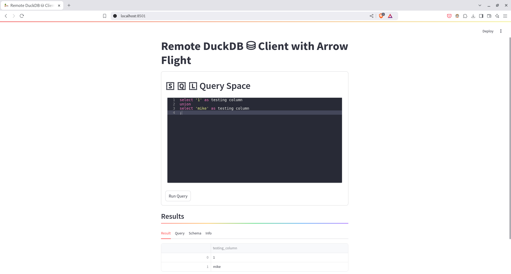

# Remote DuckDB Query Executor with Arrow Flight RPC

## Description
This project enables the execution of SQL queries to a remote [DuckDB](https://duckdb.org) instance using [Apache Arrow Flight RPC](https://arrow.apache.org/docs/format/Flight.html) and explore/download the results directly through [Streamlit](https://streamlit.io/) Web interface.


## Usage
### Requirements
Install the needed python modules
```bash
pip install -r requirements.txt
```

### Getting Started
1. Create/Update the `.env` file with the below as needed:
```bash
# CAUTION: If using the source .env commande, 
## make sure there no space before & after the '=' signs in this file

# Flight Server
SERVER_FLIGHT_HOST='0.0.0.0'
SERVER_FLIGHT_PORT=8815

# If using Local Storage for the Flight datasets
SERVER_FLIGHT_DATA_DIR_TYPE='local'  # Options: ['local', 's3', 'minio']
SERVER_FLIGHT_DATA_DIR_BASE='data/datasets'

# DuckDB file
SERVER_DUCKDB_FILE='data/duck.db'
```

2. Run the below command to launch the Apache Arrow Flight Server:
```bash
python apps/server/server.py
```

3. Run the below command to launch the Streamlit Web interface:
```bash
streamlit run apps/client/web.py
```

4. Browse to the Streamlit Web link [http://localhost:8501](http://localhost:8501)


## Demo 🚀
[](docs/recording-duckdb_arrow-flight-rpc.webm)


## Features
- [x] **Remote Query Execution**
- [ ] **View previous Queries**
- [ ] **Authentication**

Supported Storage for Apache Arrow Flight Datasets (ONLY local works Currently)
- [x] **local**: Results files are stored on the local disk of the server.
- [ ] **s3**: Results files are stored on Amazon S3. Update the `.env` to set the Access & Secret Keys.
- [ ] **minio**: Results files are stored on Amazon S3. Update the `.env` to set the Access & Secret Keys and Endpoint, etc.

- [ ] Add Docker Compose.
- [ ] Add Support for ephemeral Compute Nodes (GCP, AWS, Azure): This could reduce code for Flight Server with Duckdb.
- [ ] Add NodeManager to manage ephemeral Compute Nodes.


## Contact

If you have any questions or would like to get in touch, please open an issue on Github or send me an email: <mike.kenneth47@gmail.com>  OR [Twitter/x](https://twitter.com/mikekenneth77).
